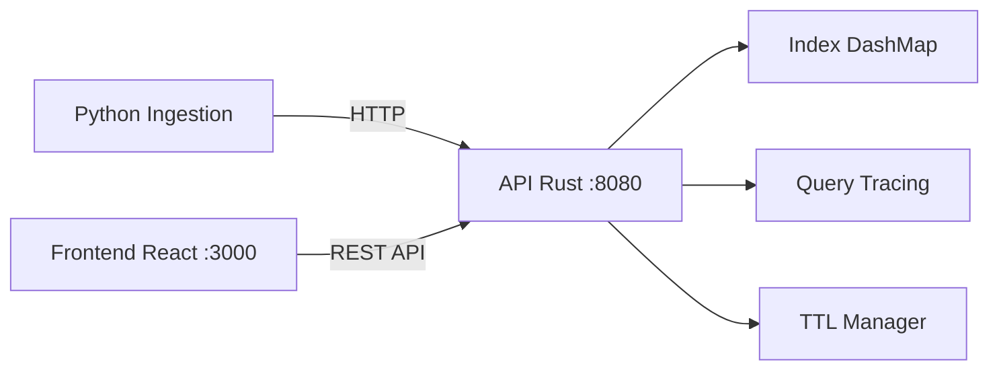

# Vector Citadel

Infrastructure d'indexation et de recherche vectorielle de classe enterprise. Architecture moderne avec tracing des requêtes, recherche hybride, et contrôle de fraîcheur des données.

## Pourquoi ce projet est crucial

Vector Citadel démontre une expertise infrastructure moderne autour des systèmes de retrieval, avec une attention particulière à la qualité de recherche, l'explicabilité, et la gouvernance des données vectorielles. Ce projet vise à concilier performance (latence <10ms), précision (rappel >95%) et opérabilité (tracing, métriques).

## Stack technique

| Couche | Technologie | Justification |
|--------|-------------|---------------|
| Core | Rust (actix-web, dashmap) | Performance mémoire, concurrence sans lock |
| Ingestion | Python (requests, numpy) | Écosystème ML, pipelines flexibles |
| Frontend | TypeScript + React (Vite, Recharts) | Hot reload, visualisation interactive |
| Index | DashMap + algorithmes linéaires | Alternative à HNSW pour simplicité initiale |

## Démarrage rapide

### En local avec Docker
```bash
docker-compose up --build
```

Services disponibles :
- `http://localhost:8080` - API Rust
- `http://localhost:3000` - Dashboard Frontend

### Développement local
```bash
# Backend Rust
cd rust-core && cargo run

# Frontend
cd frontend-dashboard && npm run dev

# Ingestion Python  
cd python-ingestion && pip install -e . && python -m ingestion.cli --demo
```

## Architecture



## Sous-systèmes

1. **Pipeline d'ingestion** - Embeddings par lots, validation, transformation
2. **Index vectoriel** - Stockage concurrent, recherche par similarité cosinus
3. **Recherche hybride** - Fusion vectoriel + filtres métadonnées
4. **Fraîcheur** - TTL, marquage temporel, GC automatisé
5. **Diagnostics** - Tracing granularisé, explicabilité du scoring

## API REST

```bash
# Health check
curl http://localhost:8080/health

# Upsert vector
curl -X POST http://localhost:8080/vectors/upsert \
  -H "Content-Type: application/json" \
  -d '{"values": [0.1, 0.2], "metadata": {"category": "tech"}}'

# Search hybride
curl -X POST http://localhost:8080/vectors/search \
  -H "Content-Type: application/json" \
  -d '{"vector": [0.1, 0.2], "limit": 10, "hybrid_alpha": 0.7}'
```

## Documentation

| Fichier | Description |
|---------|-------------|
| [ARCHITECTURE.md](docs/ARCHITECTURE.md) | Architecture détaillée, flux de données |
| [ROADMAP.md](docs/ROADMAP.md) | Feuille de route produit |
| [TRADEOFFS.md](docs/TRADEOFFS.md) | Analyse des compromis techniques |
| [API.md](docs/API.md) | Référence API complète |
| [DEPLOYMENT.md](docs/DEPLOYMENT.md) | Guide de déploiement |
| [CONTRIBUTING.md](docs/CONTRIBUTING.md) | Standards de contribution |
| [PERFORMANCE.md](docs/PERFORMANCE.md) | Benchmarks et optimisations |

## Licence

MIT License - Voir [LICENSE](LICENSE)