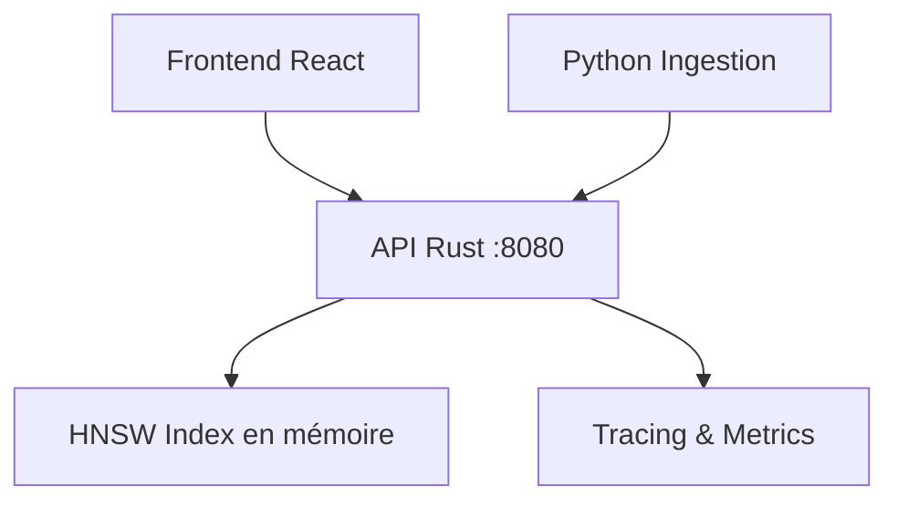

# Vector Citadel

Infrastructure d'indexation et de recherche vectorielle de classe enterprise. Architecture moderne avec tracing des requêtes, recherche hybride, et contrôle de fraîcheur des données.

## Pourquoi ce projet est crucial

Vector Citadel démontre une expertise infrastructure moderne autour des systèmes de retrieval, avec une attention particulière à la qualité de recherche, l'explicabilité, et la gouvernance des données vectorielles.

## Stack technique

- **Core** : Rust (actix-web, hnsw) - Performance critique
- **Ingestion** : Python - Pipelines de données et embeddings
- **Frontend** : TypeScript + React (Vite, TailwindCSS) - Interface de diagnostic

## Démarrage rapide

### En local avec Docker
```bash
docker-compose up
```

### Développement local
```bash
# Rust backend
cd rust-core && cargo run

# Frontend
cd frontend-dashboard && npm run dev

# Python ingestion
cd python-ingestion && pip install -e . && python -m ingestion.cli --demo
```

## Architecture



## Sous-systèmes

1. **Pipeline d'ingestion** - Embeddings par lots, validation, transformation
2. **Index vectoriel** - HNSW avec gestion des métadonnées
3. **Recherche hybride** - Fusion vectoriel + filtres métadonnées
4. **Fraîcheur** - TTL, marquage temporel, re-indexation
5. **Diagnostics** - Tracing des requêtes, explicabilité

## API REST

```bash
# Health check
curl http://localhost:8080/health

# Upsert vector
curl -X POST http://localhost:8080/vectors/upsert \
  -H "Content-Type: application/json" \
  -d '{"values": [0.1, 0.2, ...], "metadata": {"category": "tech"}}'

# Search
curl -X POST http://localhost:8080/vectors/search \
  -H "Content-Type: application/json" \
  -d '{"vector": [0.1, 0.2, ...], "limit": 10, "hybrid_alpha": 0.7}'
```

## Documentation

- [docs/ARCHITECTURE.md](docs/ARCHITECTURE.md) - Décisions d'architecture
- [docs/ROADMAP.md](docs/ROADMAP.md) - Feuille de route
- [docs/TRADEOFFS.md](docs/TRADEOFFS.md) - Compromis architecturaux
- [docs/API.md](docs/API.md) - Référence API
- [docs/DEPLOYMENT.md](docs/DEPLOYMENT.md) - Guide de déploiement
- [docs/CONTRIBUTING.md](docs/CONTRIBUTING.md) - Standards de contribution
- [docs/PERFORMANCE.md](docs/PERFORMANCE.md) - Benchmarks et optimisations