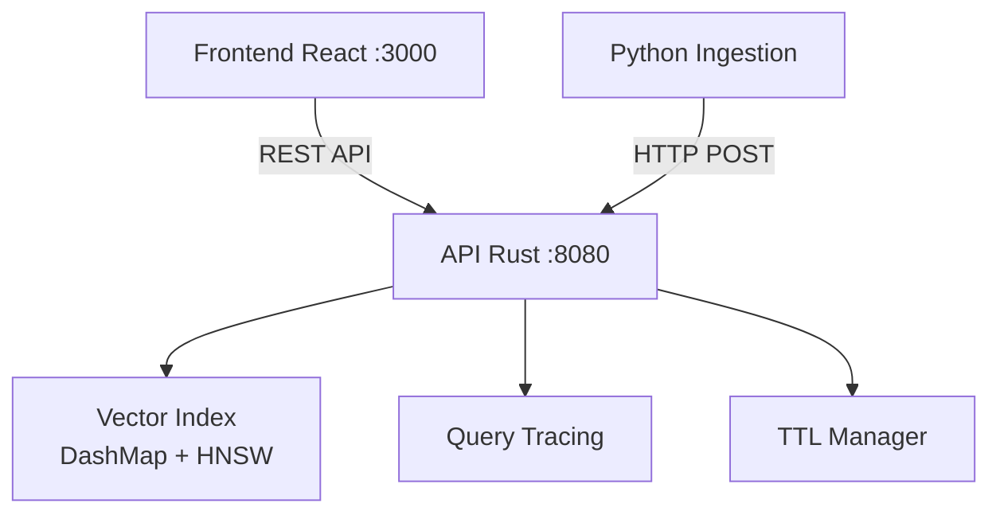

# Architecture Vector Citadel

## Vue d'ensemble

Vector Citadel est une infrastructure de recherche vectorielle enterprise organisée autour de l'ingestion d'embeddings, de la maintenance d'index, de la recherche hybride et des diagnostics de requêtes.

## Sous-systèmes core

1. **Pipeline d'ingestion** - Embedding par lots, validation, transformation
2. **Couche d'index** - DashMap + HNSW pour recherche approximative
3. **Moteur de recherche hybride** - Fusion vectoriel + filtres métadonnées
4. **Gestion de fraîcheur** - TTL, marquage temporel, GC automatique
5. **Diagnostics** - Tracing des requêtes, explicabilité du scoring

## Architecture technique

## Patterns de conception

- **Arc<DashMap>** : Partage concurrent sans lock
- **Hybrid Scoring** : `score = α × vector + (1-α) × metadata`
- **Tracing par étape** : Latence granularisée
- **GC proactive** : Nettoyage automatique des TTL expirés