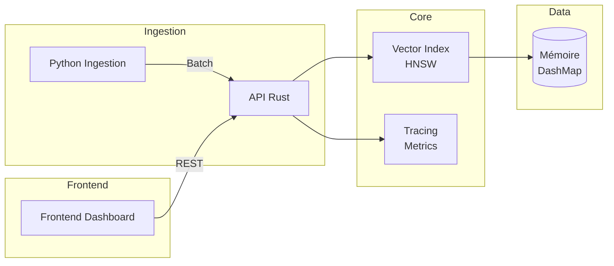

# Architecture Vector Citadel

## Vue d'ensemble

Vector Citadel suit une architecture en couches avec séparation claire des responsabilités entre ingestion, stockage, recherche, et diagnostics.



## Flux de données

1. **Ingestion** (`python-ingestion/`)
   - CLI pour générer/charger des embeddings
   - Validation des dimensions et métadonnées
   - Upsert par lots vers l'API

2. **Core** (`rust-core/`)
   - API HTTP avec Actix-web
   - Index HNSW en mémoire avec DashMap
   - Endpoint `/vectors/upsert` et `/vectors/search`

3. **Frontend** (`frontend-dashboard/`)
   - Dashboard React avec métrics temps réel
   - Recherche hybride avec filtres
   - Visualisation tracing (waterfall)

## Schéma des composants

```
rust-core/
├── src/
│   ├── main.rs          # Point d'entrée, serveur HTTP
│   ├── models.rs        # Structures Vector, Metadata, SearchResult
│   ├── routes/          # Endpoints REST
│   │   ├── health.rs    # GET /health
│   │   └── vectors.rs   # POST /vectors/*
│   └── services/        # Logique métier
│       └── vector.rs    # VectorIndexService
```

## Patterns de conception

- **Arc<DashMap>** : Partage concurrent de l'index sans mutex
- **HNSW** : Index annexe pour la recherche approximative
- **Tracing** : Chaque requête trace ses étapes (latence par étape)
- **Hybrid scoring** : Combinaison score vectoriel + métadonnées via `hybrid_alpha`