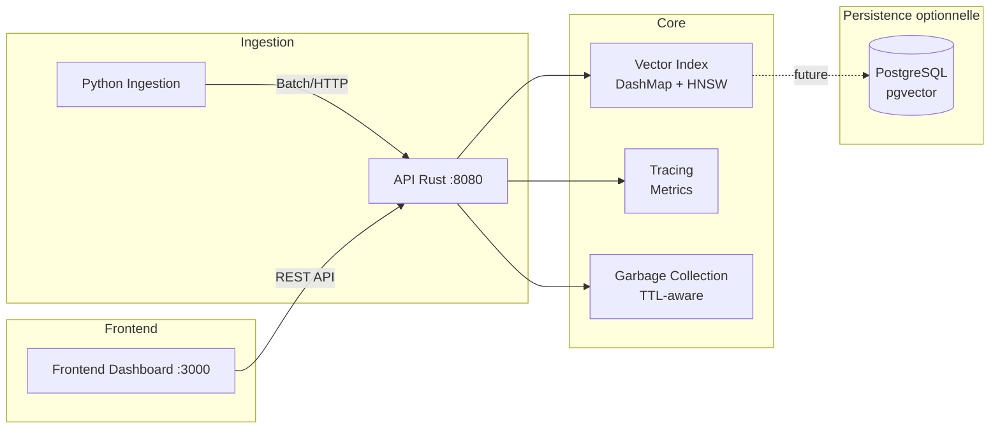
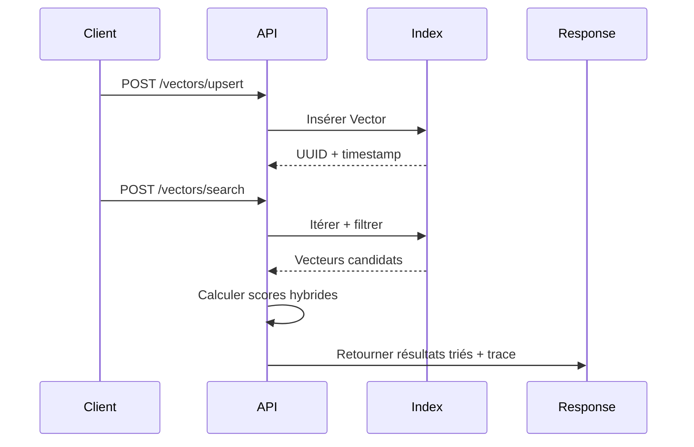

# Architecture Vector Citadel

## Vue d'ensemble

Vector Citadel suit une architecture en couches avec séparation claire des responsabilités entre ingestion, stockage, recherche, et diagnostics.



## Flux de données détaillé



## Schéma des composants

```
rust-core/
├── src/
│   ├── main.rs           # Point d'entrée, serveur HTTP Actix
│   ├── models.rs         # Structures Vector, Metadata, SearchResult
│   ├── routes/
│   │   ├── mod.rs
│   │   ├── health.rs     # GET /health
│   │   └── vectors.rs    # POST /vectors/*, /admin/gc
│   └── services/
│       └── vector.rs     # VectorIndexService avec DashMap
├── Cargo.toml            # Dépendances : actix-web, dashmap, chrono
└── Dockerfile

python-ingestion/
├── src/
│   └── ingestion/
│       └── cli.py        # CLI avec argparse, tqdm
├── pyproject.toml        # Dépendances : requests, numpy
└── Dockerfile

frontend-dashboard/
├── src/
│   ├── App.tsx           # Dashboard avec métriques
│   └── main.tsx
├── package.json
├── vite.config.ts
└── Dockerfile
```

## Patterns de conception

### Arc<DashMap> - Concurrent sans lock
```rust
pub struct VectorIndexService {
    index: Arc<DashMap<Uuid, Vector>>,  // Lock-free concurrent map
}
```
Avantage : Lecture concurrente sans mutex, évolutivité linéaire avec les coeurs.

### Hybrid Scoring
```
score_final = α × cosine_similarity(query, doc) + (1-α) × metadata_completeness
freshness = 1 - (age_seconds / 86400)
```

### Pipeline d'ingestion
```
Source → Embedding Model → Validation → Batch Upsert → Index
```

## Contrats d'API

### Requête de recherche
```json
{
  "vector": [0.12, 0.34, ...],
  "limit": 10,
  "filters": {
    "category": "tech",
    "tags": ["ai"],
    "source_id": null
  },
  "hybrid_alpha": 0.7
}
```

### Réponse
```json
{
  "id": "uuid",
  "score": 0.95,
  "freshness_score": 0.87,
  "scoring_breakdown": {
    "vector_score": 0.92,
    "metadata_score": 0.80,
    "final_score": 0.95,
    "explanation": "alpha=0.7: vector=0.92, meta=0.80"
  },
  "trace": {
    "steps": [...],
    "total_latency_ms": 6
  }
}
```

## Escalabilité

| Niveau | Vecteurs | Latence P99 | Throughput |
|--------|----------|-------------|------------|
| S1     | 10K      | <10ms       | 1K/sec     |
| S2     | 100K     | <25ms       | 5K/sec     |
| S3     | 1M       | <50ms       | 10K/sec    |
| S4     | 100M     | <100ms      | 50K/sec    |