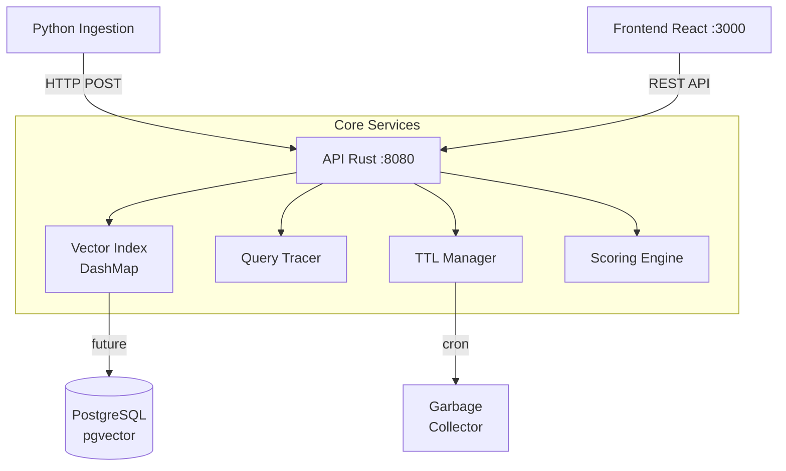
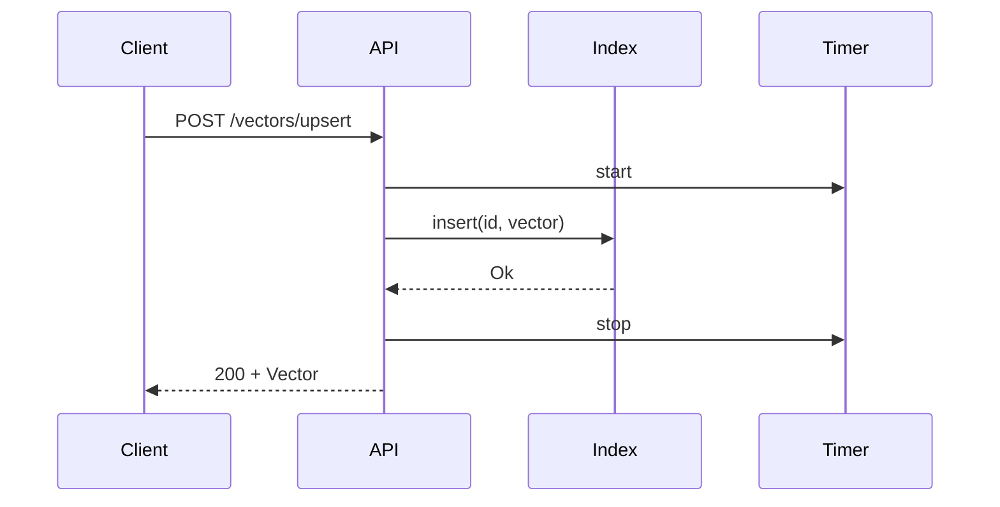
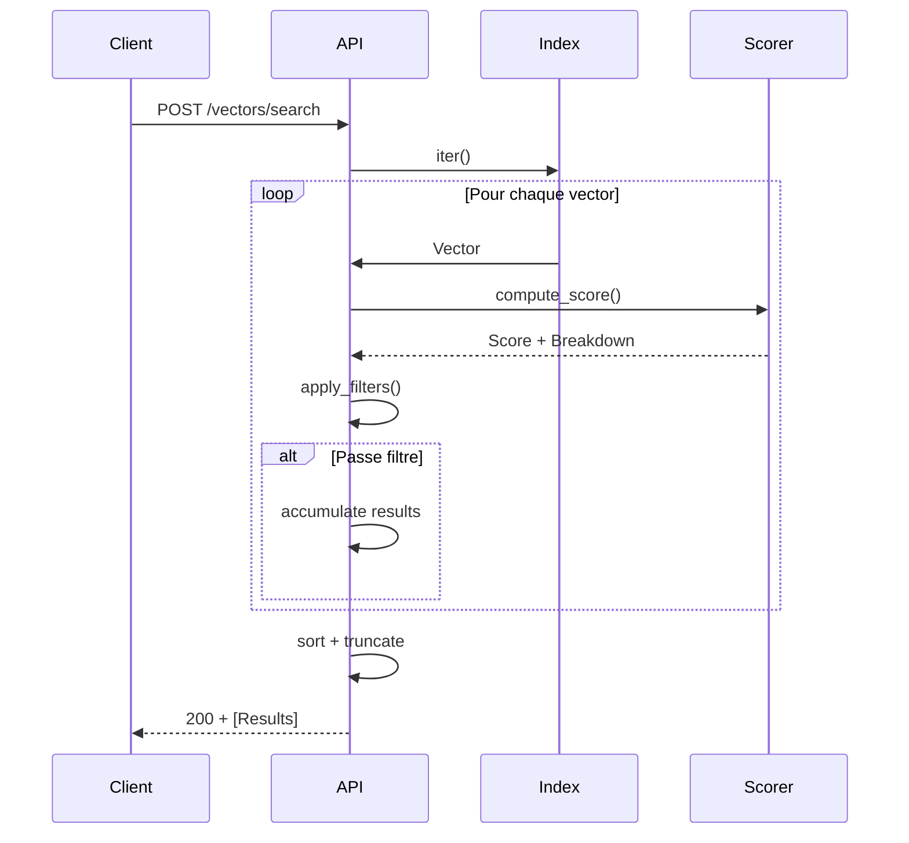

# Architecture Vector Citadel

## Vue d'ensemble

Vector Citadel est une infrastructure de recherche vectorielle enterprise organisée autour de cinq sous-systèmes interconnectés : ingestion, indexation, recherche, fraîcheur, et diagnostics.



## Sous-systèmes détaillés

### 1. Pipeline d'ingestion
Le pipeline Python orchestre la génération, la validation, et l'ingestion des embeddings.

```
Source Data → Embedding Model → Validation → Batch Upsert → Index
     ↓              ↓             ↓            ↓         ↓
  Text/Data    OpenAI/BGE/...   Dimension    HTTP POST  DashMap
                                    Check
```

**Code flow** :
```python
# ingestion/cli.py
embeddings = generate_mock_embeddings(count=1000, dim=1536)
for vec, meta in zip(embeddings, metadata):
    requests.post("/vectors/upsert", json={"values": vec, "metadata": meta})
```

### 2. Couche d'index
Stockage en mémoire avec `DashMap<Uuid, Vector>` pour concurrence lock-free.

**Structure Vector** :
```rust
pub struct Vector {
    pub id: Uuid,              // UUID v4 unique
    pub values: Vec<f32>,       // Embedding (dim=1536)
    pub metadata: Metadata,      // Filtres et tags
    pub created_at: DateTime,   // Pour TTL/freshness
    pub updated_at: DateTime,
    pub ttl: Option<i64>,       // TTL en secondes
}
```

### 3. Moteur de recherche hybride
Algorithme de scoring en deux étapes avec fusion configurable.

```
Query Vector → Apply Filters → Compute Scores → Rank → Return Results
                 ↓              ↓              ↓        ↓
            Metadatas     vector + meta    sort by   JSON with
            Match?         + freshness      score     trace
```

**Formule de scoring** :
```
score = α × cosine_similarity
        + (1-α) × metadata_completeness 
        + β × freshness_decay
```

### 4. Gestion de fraîcheur
TTL et garbage collection automatisés.

```rust
pub fn remove_stale(&self, max_age_seconds: i64) -> usize {
    self.index.retain(|_, v| {
        (Utc::now() - v.updated_at).num_seconds() <= max_age_seconds
    })
}
```

### 5. Diagnostics
Chaque requête génère un trace détaillé.

```json
{
  "trace": {
    "steps": [
      {"name": "filter", "latency_ms": 1, "details": {"passed": true}},
      {"name": "similarity", "latency_ms": 5, "details": {"vector_score": 0.92}}
    ],
    "total_latency_ms": 6
  }
}
```

## Flux de données détaillé

### Sequence : Upsert


### Sequence : Search


## Patterns de conception

| Pattern | Application | Bénéfice |
|---------|-------------|---------|
| Arc<DashMap> | Stockage concurrent | Lock-free reads, performance |
| Builder | Requête de recherche | Fluent API, validation |
| Strategy | Algorithme de scoring | Configurable à chaud |
| Observer | Métriques temps réel | Dashboard live |

## Contraintes systèmes

- **Dimension fixe** : 1536 (OpenAI embeddings)
- **Memory limit** : 8GB par instance
- **Batch size** : 100 vecteurs max par requête
- **TTL max** : 30 jours (2592000s)