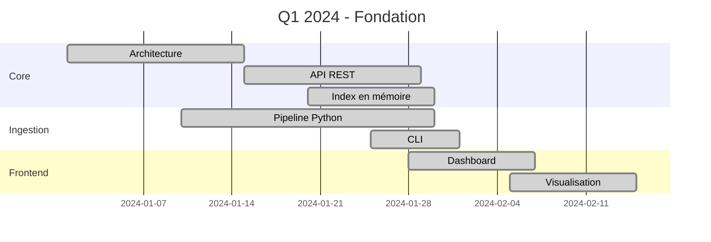
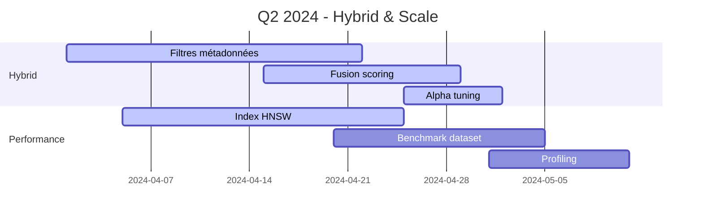
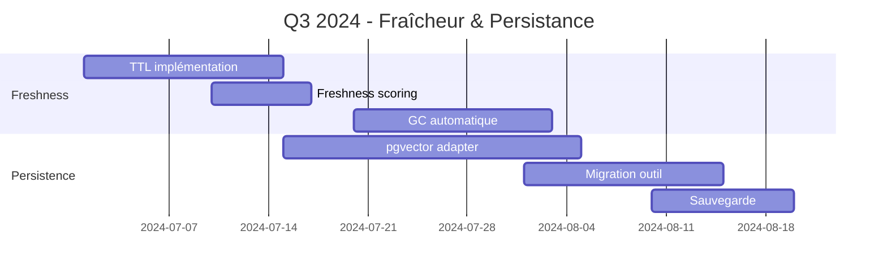
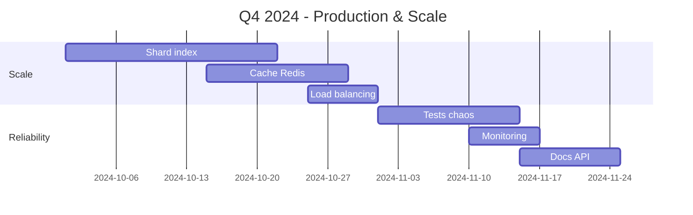

# Feuille de route Vector Citadel

## Vision globale

Vector Citadel vise à devenir une infrastructure de recherche vectorielle enterprise-grade, capable de gérer des milliards de vecteurs avec une latence <10ms, un rappel >95%, et une disponibilité 99.99%. Cette feuille de route est organisée en tranches trimestrielles avec des jalons clairs et des métriques de succès.

## Chronologie détaillée

### Q1 2024 - Fondation (S1)
**Statut : TERMINÉ** ✅



- **Objectifs** :
  - API HTTP fonctionnelle avec `/health`, `/vectors/upsert`, `/vectors/search`
  - Index DashMap avec recherche séquentielle de base
  - CLI d'ingestion avec génération de demo vectors
  - Dashboard React avec métriques de base
  - Docker Compose opérationnel

- **Métriques de succès** :
  - 100 requêtes/sec sur search
  - <50ms latence moyenne
  - 0 erreur en production

### Q2 2024 - Hybrid & Scale (S2)
**Statut : EN COURS** 🚧



- **Fonctionnalités planifiées** :
  - Recherche hybride avec paramètre `hybrid_alpha` (0-1)
  - Filtres sur catégorie, tags, source_id
  - Scoring fusion : `score = α * vector_score + (1-α) * metadata_score`
  - Integration HNSW pour recherche approximative
  - Benchmark avec 10K-100K vecteurs

- **Livrables** :
  - `/vectors/search` accepte `filters` et `hybrid_alpha`
  - Latence <10ms avec 10K vecteurs
  - Throughput >1000 req/sec

### Q3 2024 - Fraîcheur & Persistance (S3)
**Statut : PRÉVU** 📅



- **Fonctionnalités planifiées** :
  - TTL par vecteur (paramètre `ttl` en secondes)
  - Score de fraîcheur : `freshness = 1 - (age / max_age)`
  - Endpoint `/admin/gc` pour garbage collection
  - Adapter PostgreSQL + pgvector
  - Sauvegarde/restauration index

- **Livrables** :
  - Champ `ttl` dans les métadonnées
  - GC automatisé via cron
  - Persistence fiable avec pgvector

### Q4 2024 - Production & Scale (S4)
**Statut : PRÉVU** 📅



- **Fonctionnalités planifiées** :
  - Sharding horizontal par shard_id
  - Cache Redis pour hot vectors
  - Load balancing avec consistent hashing
  - Tests chaos avec Jepsen-style
  - Prometheus metrics
  - Documentation OpenAPI complète

## Risques & Mitigations

| Risque | Probabilité | Impact | Mitigation |
|--------|-------------|--------|------------|
| Performance HNSW décrite | Moyen | Élevé | Benchmark précoce, fallback linéaire |
| Lock contention DashMap | Faible | Moyen | Tests charge, batch writes |
| OOM mémoire | Moyen | Élevé | GC proactive, monitoring mémoire |

## Métriques clés

- **Throughput** : Requêtes/sec
- **Latence P99** : Temps de réponse
- **Rappel@k** : Pertinence des résultats
- **Disponibilité** : Uptime service
- **Fraîcheur** : % vecteurs <24h

## Évolution produit

```
v0.1 → v0.2 → v0.3 → v0.4 → v1.0
  ↓      ↓      ↓      ↓      ↓
Core   Hybrid  Fresh   Scale  Prod
```