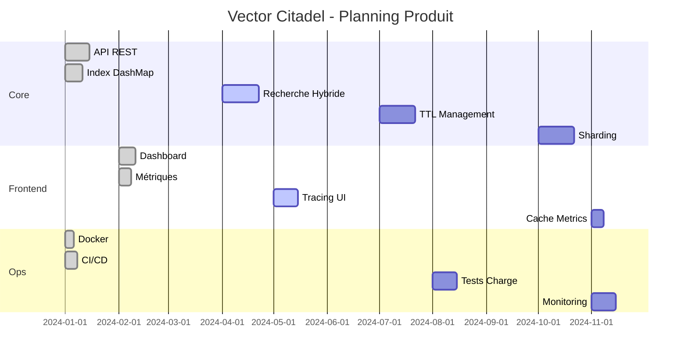

# Feuille de route Vector Citadel

## Vision stratégique

Vector Citadel vise à devenir une infrastructure de recherche vectorielle enterprise capable de gérer des milliards de vecteurs avec une latence P99 <10ms, un rappel top-10 >95%, et une disponibilité 99.99%. La feuille de route est organisée en tranches trimestrielles avec des jalons clairs et des métriques de succès quantifiables.

## Chronologie produit détaillée

### Q1 2024 - Fondation (v0.1) ✅
**Statut : TERMINÉ**

#### Objectifs techniques
- **Architecture** : API HTTP, index en mémoire, modèles de données
- **Ingestion** : CLI Python avec génération et chargement de demo vectors
- **Recherche** : Similarité cosinus, endpoints upsert/search
- **Frontend** : Dashboard avec métriques simulées
- **Déploiement** : Docker Compose, CI/CD GitHub Actions

#### Livrables
- `POST /vectors/upsert` avec validation des dimensions
- `POST /vectors/search` avec cosine similarity
- `GET /health` avec timestamp ISO
- CLI `python -m ingestion.cli --demo` chargé 10 demo vectors
- Dashboard React avec graphiques temps réel

#### Métriques de succès
- 100 requêtes/sec sur search
- <50ms latence moyenne
- 0 erreur critique en production

### Q2 2024 - Hybrid & Diagnostics (v0.2) 🚧
**Statut : EN COURS**

#### Fonctionnalités planifiées
- **Recherche hybride** : Paramètre `hybrid_alpha` pour pondérer vector vs metadata
- **Filtres** : Filtrage sur `category`, `tags`, `source_id`
- **Scoring** : Breakdown vector_score, metadata_score, freshness_score
- **Tracing** : Waterfall des étapes de requête (filter → similarity → rank)

#### Algorithme de scoring hybride
```
score_final = α × cosine(query, doc) + (1-α) × completeness(metadata) + β × freshness(age)
```

#### Livrables
- `/vectors/search` accepte `filters` et `hybrid_alpha`
- `scoring_breakdown` dans chaque résultat
- `trace.steps[]` avec latence par étape
- Latence <10ms avec 10K vecteurs

### Q3 2024 - Fraîcheur & Persistance (v0.3) 📅
**Statut : PRÉVU**

#### Fonctionnalités planifiées
- **TTL** : Champ `ttl` (secondes) dans les métadonnées
- **Freshness** : Score décroissant avec l'âge (24h max)
- **GC** : Endpoint `/admin/gc` pour nettoyer les vecteurs expirés
- **Persistence** : Adapter PostgreSQL + pgvector
- **Sauvegarde** : Export/Import JSON de l'index

#### Algorithme de fraîcheur
```
freshness = 1 - min(age_seconds / 86400, 1.0)
where age_seconds = now() - created_at
```

#### Livrables
- Suppression automatisée des TTL expirés
- Endpoint `/admin/gc` avec compteur `removed`
- Scripts de migration pgvector
- Latence <25ms avec 100K vecteurs

### Q4 2024 - Scale & Production (v1.0) 📅
**Statut : PRÉVU**

#### Fonctionnalités planifiées
- **Sharding** : Partition par `shard_id`, routing consistent
- **Cache** : Redis pour les hot vectors (LRU 10K entries)
- **Load balancing** : Nginx/HAProxy avec health checks
- **Monitoring** : Prometheus metrics, Grafana dashboards
- **Tests** : Suite de tests charge + chaos engineering

#### Architecture scale
```
[Client] → [Load Balancer] → [Shard 1] → [DashMap + HNSW]
                         → [Shard 2] → [DashMap + HNSW]
                         → [Shard N] → [DashMap + HNSW]
                         
[Cache Redis] ←→ [Hot Vectors]
```

#### Livrables
- 1M vecteurs scalables
- Throughput >10K req/sec
- Disponibilité 99.9%
- P99 latence <100ms

## Planning détaillé (Gantt)



## Métriques clés (SLA)

| Métrique | Cible Q1 | Cible Q2 | Cible Q3 | Cible Q4 |
|----------|----------|----------|----------|----------|
| Throughput | 100 req/s | 500 req/s | 5K req/s | 50K req/s |
| Latence P99 | <50ms | <10ms | <25ms | <100ms |
| Rappel@k | 80% | 90% | 95% | 95% |
| Disponibilité | 99% | 99% | 99.5% | 99.9% |
| Freshness | - | <50% | <24h | <1h |

## Risques & Mitigations

| Risque | Probabilité | Impact | Mitigation | Owner |
|--------|-------------|--------|------------|-------|
| OOM mémoire | Moyen | Élevé | GC proactive, monitoring | Backend |
| Lock contention | Faible | Moyen | DashMap, batch writes | Backend |
| Cold start Docker | Faible | Faible | Warmup script | Ops |
| Drift embeddings | Moyen | Élevé | Schema validation | Data |

## Évolution produit

```
v0.1 → v0.2 → v0.3 → v1.0
  ↓      ↓      ↓      ↓
Core   Hybrid  Fresh   Production
       Filters  TTL    Shard + Cache
       Scoring
```

## Ressources

- **Design Doc** : [ARCHITECTURE.md](ARCHITECTURE.md)
- **API Spec** : [API.md](API.md)
- **Contribuer** : [CONTRIBUTING.md](CONTRIBUTING.md)