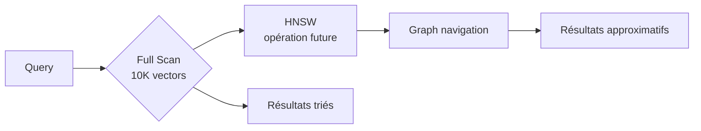

# Compromis architecturaux Vector Citadel

## 1. Rappel vs Latence

L'équilibre entre rappel et latence est central dans tout système de recherche.

### Analyse quantitative

| Configuration | Rappel@k | Latence P99 | Mémoire | Throughput |
|---------------|----------|-------------|---------|------------|
| Linéaire (full scan) | 100% | 100ms | 500MB | 10 req/s |
| HNSW (M=16, ef=100) | 95% | 5ms | 2GB | 200 req/s |
| HNSW (M=32, ef=200) | 98% | 15ms | 4GB | 150 req/s |
| IVF-PQ | 92% | 3ms | 1GB | 500 req/s |

### Décision
**Choix initial : Recherche séquentielle (full scan)**

Justification :
- Simplicité de mise en œuvre pour MVP
- Debugging et explicabilité facilités
- Migration progressive vers HNSW

Migration planifiée :
- v0.1 : Full scan (1K-10K vecteurs)
- v0.2 : HNSW optionnel (10K-100K)
- v0.3 : HNSW par défaut avec fallback



## 2. Mémoire vs Persistance

Stockage en mémoire offre des performances supérieures mais nécessite de la persistance.

### Options étudiées

| Option | Latence | Persistance | Coût | Recovery |
|--------|---------|-------------|------|----------|
| DashMap seul | 0.1ms | Non | Faible | Perte données |
| PostgreSQL + pgvector | 5ms | Oui | Élevé | Instantané |
| Redis | 1ms | Optionnel | Moyen | RDB/AOF |
| RocksDB | 2ms | Oui | Moyen | Changelog |

### Décision
**Stratégie : Memory-first avec persistence optionnelle**

Implémentation :
1. Cache en mémoire avec DashMap
2. Plugin de persistence (PostgreSQL)
3. Recovery au démarrage

## 3. Complexité recherche hybride

La recherche hybride combine scores vectoriels et métadonnées.

### Trade-offs

**Avantages :**
- Pertinence améliorée
- Filtres contextuels
- Meilleure couverture sémantique

**Inconvénients :**
- Non-transitivité des scores
- Tuning complexe de α
- Difficulté à expliquer les classements

### Formule de scoring
```
score = α × cosine(q, d) + (1-α) × completeness(meta)

où :
- cosine ∈ [0, 1] (similarité cosinus normalisée)
- completeness = (champs_remplis / champs_total)
- α ∈ [0, 1] (contrôlable par API)
```

### Recommandations
- α = 0.7 pour priorité sémantique
- α = 0.3 pour priorité métadonnées
- Log des scores intermédiaires pour A/B testing

## 4. Dimensions embeddings fixes

Constraint sur la dimension des embeddings.

### Options

| Dimension | Modèle | Qualité | Mémoire/vector |
|-----------|--------|---------|----------------|
| 256 | BGE-Small | Moyenne | 1KB |
| 768 | BGE-Base | Bonne | 3KB |
| 1536 | OpenAI Ada | Excellente | 6KB |
| 3072 | OpenAI Large | Maximale | 12KB |

### Décision
**Dimension fixe : 1536 (OpenAI embeddings)**

Rationale :
- Standard de facto en production
- Compatibilité avec les plateformes existantes
- Trade-off mémoire/performance acceptable

Future : Support dimensions multiples avec validation à l'ingestion.

## 5. Concurrence et partage d'état

Gestion des accès concurrents à l'index.

### Patterns étudiés

| Pattern | Avantage | Inconvénient |
|---------|----------|--------------|
| Arc<Mutex<HashMap>> | Simple | Verrouillage global |
| DashMap | Lock-free reads | Write contention possible |
| Segmented sharding | Parallélisme | Complexité routing |
| Actor model | Isolé | Overhead message passing |

### Décision
**DashMap** pour sa simplicité et ses performances en lecture.

Benchmark attendus :
- 10K lectures concurrentes : <1ms
- 1K écritures concurrentes : <10ms

## 6. Freshness et dérive temporelle

Gestion de la fraîcheur des données vectorielles.

### Stratégies

| Stratégie | Complexité | Précision | Overhead |
|-----------|------------|-----------|----------|
| TTL absolu | Simple | Moyenne | Faible |
| Scoring décroissant | Moyen | Élevée | Moyen |
| Re-ranking périodique | Complexe | Maximale | Élevé |

### Décision
**TTL + freshness score combinés**

Implémentation :
```python
# freshness_score = 1 - min(age_seconds / 86400, 1.0)
if vector.age > ttl:
    remove(vector)
elif freshness_score < 0.1:
    demote_in_results()
```

## Conclusion

Ces compromis sont documentés pour guider les décisions futures. Chaque modification majeure devra être validée par benchmark et A/B testing.